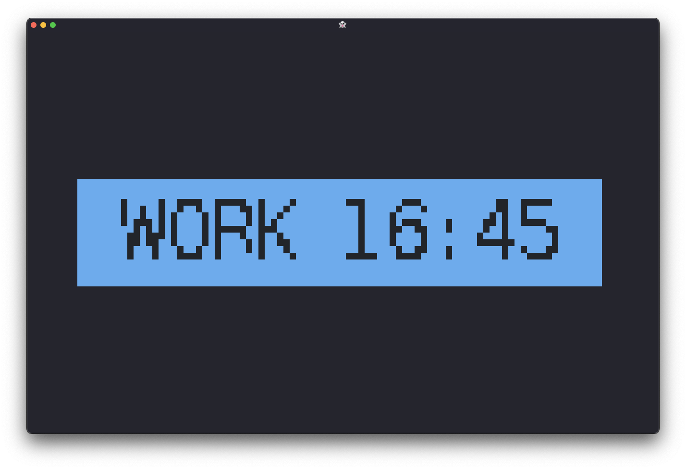
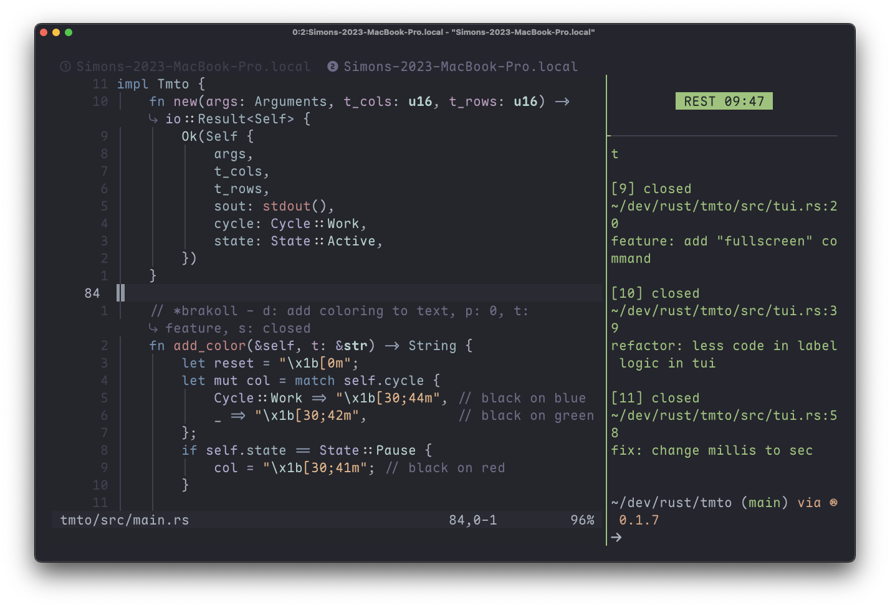
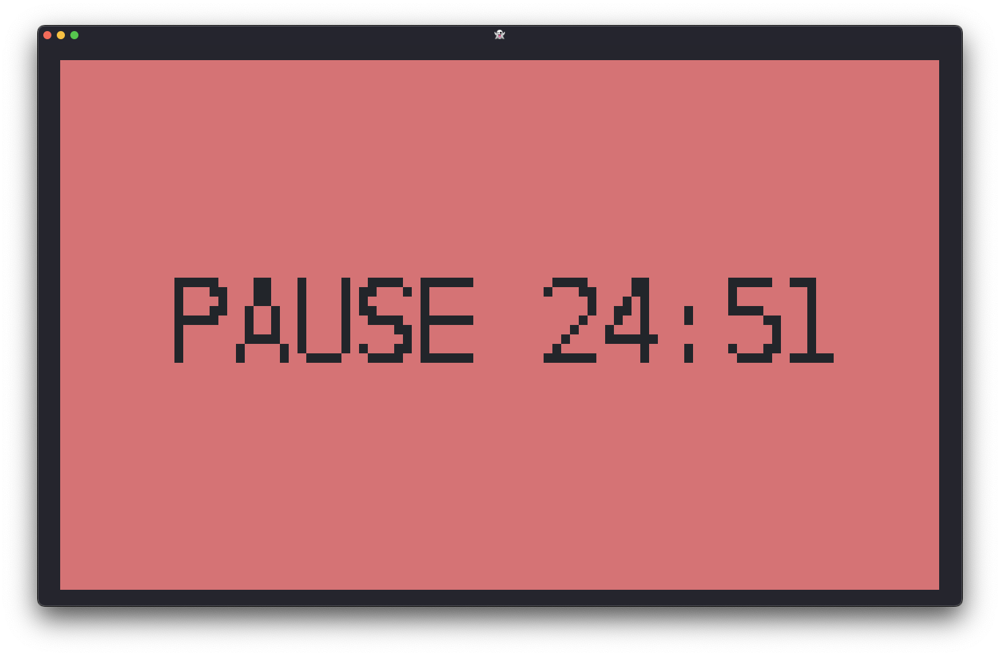

<h1 align="center">
    tmto
</h1>
  
<p align="center">
  <em>Minimal pomodoro timer in the TUI.</em>
</p>
  
<p align="center">
    
    
  
</p>
  
<p align="center">
  <a href="#install">Install</a> •
  <a href="#usage">Usage</a> •
  <a href="#deps">Dependencies</a> •
  <a href="#license">License</a> •
  <a href="#screenshots">Screenshots</a>
</p>  

---
<div id="install"></div>

## Install
    
``` bash
cargo install tmto
```
   
---
<div id="usage"></div>

## Usage
  
``` terminal
Subcommands:
help -> print help
big -> render as large text
fill -> fill entire viewport with color

Flags:
-t <int> -> duration of a complete work-rest cycle in minutes
-r <int> -> duration of the rest interval

(work duration = total duration - rest duration)

Example usages:
$ tmto -t 30 -r 10
$ tmto big -t 60 -r 20
$ tmto fill -t 20 -r 5
$ tmto fill big -t 15 -r 5

Controls:
[Ctrl-C] -> quit
[Escape] -> quit
Any key -> pause
```
   
---
<div id="deps"></div>

## Dependencies
  
- [crossterm](https://github.com/crossterm-rs/crossterm) 
- [figlet-rs](https://github.com/yuanbohan/rs-figlet) 
  
---
<div id="license"></div>

## License
This project is licensed under the [MIT License](https://github.com/simon-danielsson/tmto/blob/main/LICENSE).  
   
---
<div id="screenshots"></div>
  
## Screenshots   




